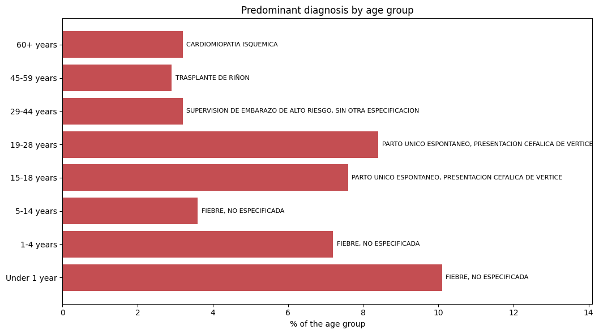
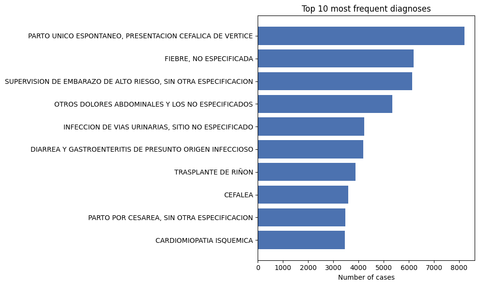
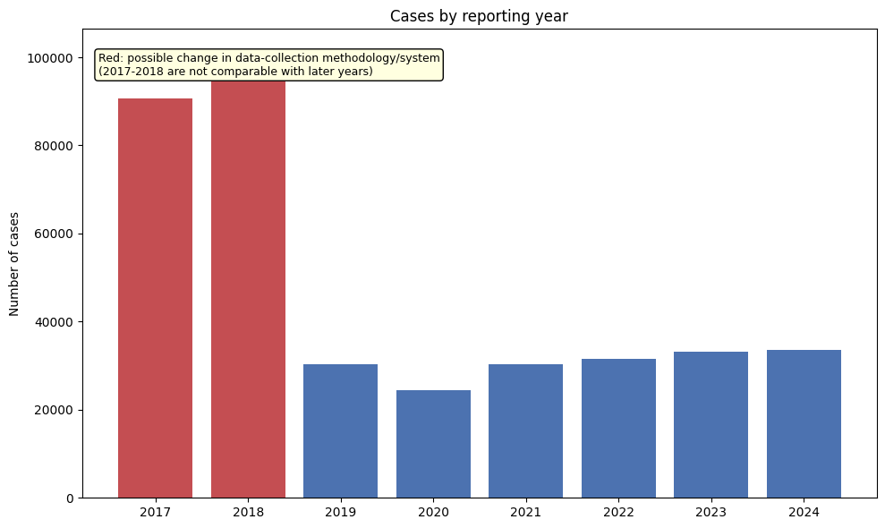
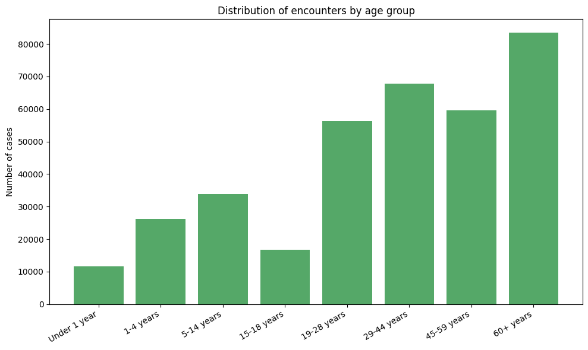
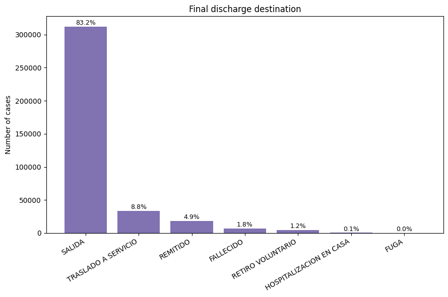

# Hospital Morbidity Analysis 🏥📊

Exploratory data analysis and visualization of 375K+ hospital encounters from a Colombian public hospital, uncovering how diagnosis patterns shift across the human life cycle.

[](https://colab.research.google.com/github/dscastillo31-ux/hospital-morbidity-analysis/blob/main/Health_Data_Visualization_Report.ipynb)


---

## 📌 Key finding

The dataset reveals a clear **"life-cycle extremes" pattern**: pediatric infectious disease dominates early childhood, maternal-perinatal care dominates reproductive age, and cardiovascular disease dominates older adulthood (60+) — which is also the single largest patient segment by volume.



## 🗂️ Dataset

- **Source:** [Perfil de Morbilidad](https://www.datos.gov.co/Salud-y-Protecci-n-Social/Perfil-de-morbilidad/5c4n-qdbv) — Colombia's national open data portal (datos.gov.co)
- **Provider:** E.S.E. Hospital Universitario Hernando Moncaleano Perdomo (Neiva, Huila)
- **Size:** 375,276 patient encounters × 6 raw columns
- **Access:** pulled directly from the Socrata Open Data (SODA) API — no manual file download required, fully reproducible end-to-end

## 🔧 What this project demonstrates

- **Data cleaning at scale:** fixing a mislabeled column, converting text-formatted numerics, and resolving 94 overlapping/redundant categories in a raw "discharge destination" field down to 8 clean outcome categories.
- **Feature engineering:** deriving age groups and a standardized discharge-outcome variable from messy source fields.
- **Memory-aware data types:** downcasting numeric columns and converting repeated text fields to `category` dtype.
- **Exploratory analysis:** frequency analysis, cross-tabulation by age group, and outcome-rate calculations (mortality, referral).
- **Visualization:** five matplotlib charts built from scratch (no seaborn), each designed to answer a specific analytical question.
- **Reproducibility:** the notebook reads live data via API rather than a static uploaded file, with a documented fallback path.

## 📊 Visualizations included

**Top 10 most frequent diagnoses** — what conditions consume the most institutional attention overall?


**Cases by reporting year** — is yearly case volume consistent, or are there data-quality anomalies?


**Encounters by age group** — where is patient volume concentrated?


**Final discharge destination** — what share of patients are discharged, referred, or deceased?


**Predominant diagnosis by age group** — does the type of care demanded change systematically with age? *(key chart — see finding above)*


## 🛠️ How to run it

1. Open the notebook in Google Colab using the badge above, **or** clone this repo and open `Health_Data_Visualization_Report.ipynb` locally.
2. Run all cells — the dataset loads automatically from the API, no setup required.
3. Requires: `pandas`, `matplotlib` (both pre-installed in Colab).

## 📁 Repository structure

```
.
├── Health_Data_Visualization_Report.ipynb   # Full analysis: cleaning → EDA → visualization → findings
└── README.md
```

## 📄 License

Underlying data is published by datos.gov.co under an open data license (CC BY-SA 4.0). This analysis code is shared for portfolio and educational purposes.

---

**Author:** [Your Name] — [LinkedIn](#) · [Portfolio](#)
